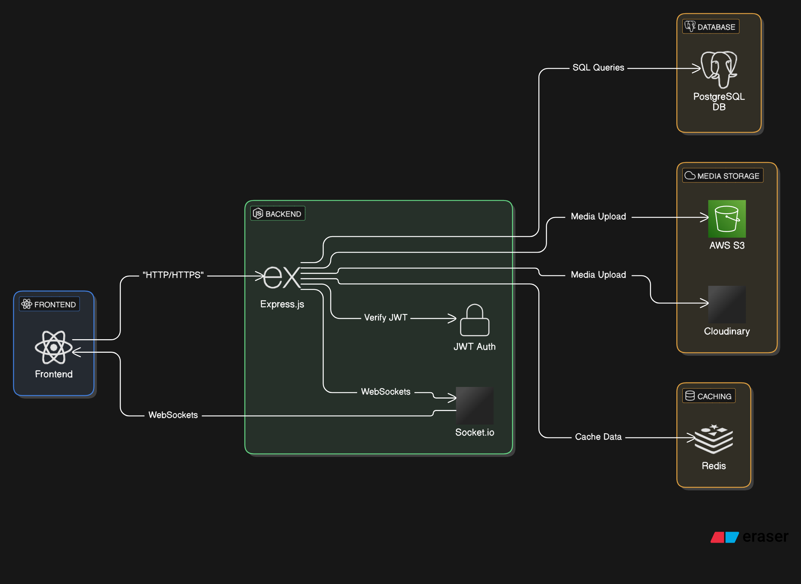

# System Design: Social Media App (PERN Stack)

## **1. System Overview**

A **social media app** typically has the following features:

- **User Authentication** (Signup, Login, JWT-based auth)
- **User Profiles** (Bio, Profile Picture, etc.)
- **Posts** (Text, Images, Videos)
- **Likes & Comments**
- **Friend Requests / Followers**
- **Notifications**
- **Messaging (Optional)**

---

## **2. Tech Stack**

| Component          | Technology                                       |
| ------------------ | ------------------------------------------------ |
| Frontend           | React (Vite or CRA)                              |
| Backend            | Node.js with Express.js                          |
| Database           | PostgreSQL with Sequelize / Knex.js              |
| Authentication     | JWT (JSON Web Token)                             |
| Storage            | Cloudinary / AWS S3 (for media files)            |
| Real-time Features | Socket.io (for chat & notifications)             |
| Deployment         | Vercel (Frontend), Railway/Render (Backend & DB) |

---

## **3. System Architecture**

### **3.1 High-Level Architecture**

```
Client (React)  <-->  API Gateway (Express.js)  <-->  PostgreSQL DB
                        |
                        └──> Cloudinary / S3 (Media Storage)
                        └──> Redis (Caching, Optional)
                        └──> Socket.io (Real-time Chat)
```

---

## **4. Database Schema (PostgreSQL)**

### **4.1 User Table**

```sql
CREATE TABLE users (
    id UUID PRIMARY KEY DEFAULT gen_random_uuid(),
    username VARCHAR(50) UNIQUE NOT NULL,
    email VARCHAR(100) UNIQUE NOT NULL,
    password TEXT NOT NULL,
    bio TEXT,
    profile_picture TEXT,
    created_at TIMESTAMP DEFAULT NOW(),
    updated_at TIMESTAMP DEFAULT NOW()
);
```

### **4.2 Posts Table**

```sql
CREATE TABLE posts (
    id UUID PRIMARY KEY DEFAULT gen_random_uuid(),
    user_id UUID REFERENCES users(id) ON DELETE CASCADE,
    content TEXT,
    image_url TEXT,
    created_at TIMESTAMP DEFAULT NOW()
);
```

### **4.3 Likes Table**

```sql
CREATE TABLE likes (
    id UUID PRIMARY KEY DEFAULT gen_random_uuid(),
    user_id UUID REFERENCES users(id) ON DELETE CASCADE,
    post_id UUID REFERENCES posts(id) ON DELETE CASCADE,
    created_at TIMESTAMP DEFAULT NOW()
);
```

### **4.4 Comments Table**

```sql
CREATE TABLE comments (
    id UUID PRIMARY KEY DEFAULT gen_random_uuid(),
    user_id UUID REFERENCES users(id) ON DELETE CASCADE,
    post_id UUID REFERENCES posts(id) ON DELETE CASCADE,
    content TEXT,
    created_at TIMESTAMP DEFAULT NOW()
);
```

### **4.5 Friendships (Following System)**

```sql
CREATE TABLE friendships (
    id UUID PRIMARY KEY DEFAULT gen_random_uuid(),
    user_id UUID REFERENCES users(id) ON DELETE CASCADE,
    friend_id UUID REFERENCES users(id) ON DELETE CASCADE,
    status VARCHAR(20) CHECK (status IN ('pending', 'accepted')),
    created_at TIMESTAMP DEFAULT NOW()
);
```

### **4.6 Notifications**

```sql
CREATE TABLE notifications (
    id UUID PRIMARY KEY DEFAULT gen_random_uuid(),
    user_id UUID REFERENCES users(id) ON DELETE CASCADE,
    type VARCHAR(50),  -- 'like', 'comment', 'follow'
    related_id UUID,
    seen BOOLEAN DEFAULT FALSE,
    created_at TIMESTAMP DEFAULT NOW()
);
```

---

## **5. API Design (Express.js)**

### **5.1 Authentication**

| Method | Endpoint         | Description                  |
| ------ | ---------------- | ---------------------------- |
| POST   | `/auth/register` | Register a new user          |
| POST   | `/auth/login`    | Login and get JWT token      |
| GET    | `/auth/profile`  | Get user profile (Protected) |

### **5.2 Posts**

| Method | Endpoint     | Description       |
| ------ | ------------ | ----------------- |
| GET    | `/posts`     | Get all posts     |
| POST   | `/posts`     | Create a new post |
| DELETE | `/posts/:id` | Delete a post     |

### **5.3 Likes & Comments**

| Method | Endpoint             | Description       |
| ------ | -------------------- | ----------------- |
| POST   | `/posts/:id/like`    | Like a post       |
| POST   | `/posts/:id/comment` | Comment on a post |

### **5.4 Friendships**

| Method | Endpoint               | Description           |
| ------ | ---------------------- | --------------------- |
| POST   | `/friends/request/:id` | Send friend request   |
| POST   | `/friends/accept/:id`  | Accept friend request |

### **5.5 Notifications**

| Method | Endpoint         | Description       |
| ------ | ---------------- | ----------------- |
| GET    | `/notifications` | Get notifications |

---

## **6. Authentication (JWT)**

```js
const jwt = require("jsonwebtoken");

// Middleware to verify token
const verifyToken = (req, res, next) => {
  const token = req.headers.authorization?.split(" ")[1];
  if (!token) return res.status(401).json({ message: "Unauthorized" });

  jwt.verify(token, process.env.JWT_SECRET, (err, decoded) => {
    if (err) return res.status(403).json({ message: "Invalid Token" });
    req.user = decoded;
    next();
  });
};
```

---

## **7. Frontend (React)**

- **React Router** for navigation
- **Context API / Redux** for state management
- **Axios** for API calls
- **TailwindCSS / Material-UI** for UI
- **React Query** for data fetching

---

## **8. Real-Time Features (Socket.io)**

```js
const io = require("socket.io")(server, {
  cors: { origin: "http://localhost:3000" },
});

io.on("connection", (socket) => {
  console.log("User connected:", socket.id);

  socket.on("sendMessage", (data) => {
    io.to(data.receiverId).emit("receiveMessage", data);
  });

  socket.on("disconnect", () => {
    console.log("User disconnected:", socket.id);
  });
});
```

---

## **9. Deployment Strategy**

- **Frontend (React)** → Deploy on **Vercel / Netlify**
- **Backend (Express.js)** → Deploy on **Render / Railway**
- **Database (PostgreSQL)** → Use **NeonDB / Supabase / Railway**
- **Media Storage** → Use **Cloudinary / AWS S3**
- **WebSockets** → Use **Socket.io with a dedicated server**

---

## **10. Scalability & Optimization**

✅ **Use Redis** for caching frequently accessed data  
✅ **Use Load Balancers** to handle high traffic  
✅ **Optimize Database Queries** using indexes & pagination  
✅ **Separate Microservices** if needed (Auth, Posts, Notifications)

---

### 🎯 **Conclusion**

This **PERN Stack**-based social media app follows a **scalable, modular, and efficient** design. You can **extend** it with more features like **stories, groups, and video calls**. 🚀



---

### **Improvements**

- We can show posts based on whether the user has already viewed it or not.